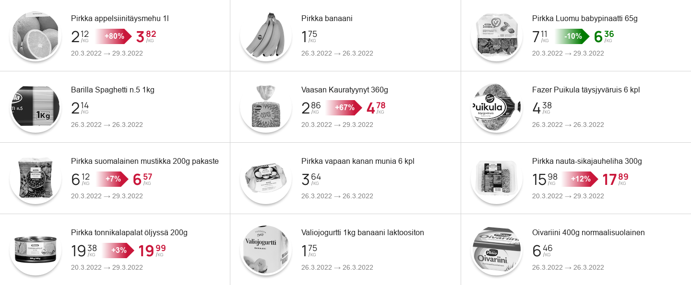

# hs

A Node.js app for monitoring trends in retail prices at Kesko's grocery stores (e.g. K-Market).

The app lets you log prices on given products and view their changes over time.

\
*Viewing logged data (randomly-generated prices).*

## Features
- JavaScript + Node.js, with minimal root dependencies
- Easy to log prices, automatable with e.g. cron
- Data can be logged into a Postgres database or standalone JSON files
- Clean, simple web interface for viewing logged data in a browser
- Server-side rendering allows the web interface to work with or without JavaScript

The app is currently work in progress.

## Usage

### Overview

Hs has two components: logger ([fetch.mjs](./src/fetch.mjs)) and server ([serve.mjs](./src/serve.mjs)).

The logger uses Puppeteer to fetch price data from a given K store via the [K-Ruoka](https://www.k-ruoka.fi/) website, maintaining the information in a JSON database.

The server generates and serves a web page for displaying the database's contents to a client browser.

### Sample

You can find a simple sample of hs under [sample/local/](./sample/local/). It monitors the prices of three products sold at K-Market Erottaja.

#### Config file

Hs uses a config file to set certain operating parameters. The sample's config is loaded from [sample/local/hs.json](./sample/local/hs.json).

| Property | Explanation |
| -------- | ----------- |
| `description` | A string that will be displayed in the header of the generated web interface. Can use HTML formatting. |
| `database` | An object that provides information about the database to be used for storing logged data. |
| `database.type` | Identifies whether to use a flat-file (`"file"`) or Postgres (`"postgres"`) database. |
| `database.baseDirectory` | For flat-file databases. Identifies the root directory into which the database's files will be placed. |
| `stores` | An array naming the stores for which prices will be logged; using the IDs of K-Ruoka.fi (e.g. `"k-market-erottaja"` for [K-Market Erottaja](https://www.k-ruoka.fi/kauppa/k-market-erottaja)). |
| `products` | An array identifying the products whose prices will be logged. |

#### Logging

To fetch and log the current prices of the three products, run `$ node ./src/fetch.mjs ./sample/local/hs.json` from the repo's root. By default, the fetch script has a generous cool-down period for network requests, so this should take about 15 seconds to complete.

Once the fetcher has completed, you should see a new directory called `k-market-erottaja` under `./sample/local/files`. The directory should contain three JSON files, one for each product.

Depending on your needs, you could set up a cron job to run the logger at given intervals, e.g. once per day.

#### Serving

To view the data that you're logging, start hs's web server by running `$ node ./src/serve.mjs ./sample/local/hs.json 8115` from the repo's root.

Once the server is running, point your browser to `http://localhost:8115`, and you should see the three products appear.

The web interface doesn't yet support segregating the view by store, so even if you're logging prices across multiple stores, the results will all be lumped together on the page.

### A note about dependencies

The app's `package.json` currently combines the dependencies of both the logger and the server; but one or the other alone needs only some of the dependencies. For example, the server only depends on `pg`, and only if using a Postgres database.

In the future, the project might be split into multiple packages. But for now, if you want to avoid installing unnecessary dependencies, you can prune the package file as needed for your purposes.
